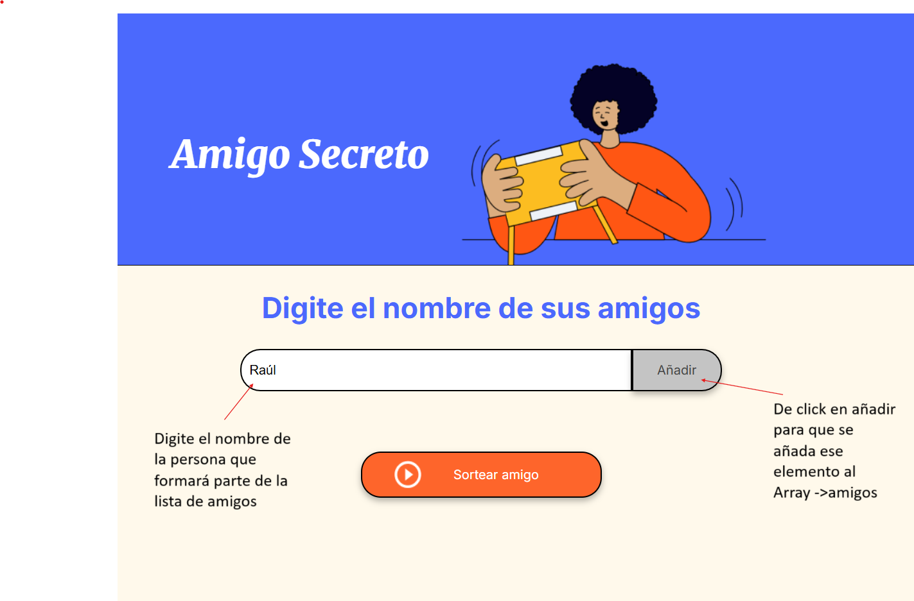
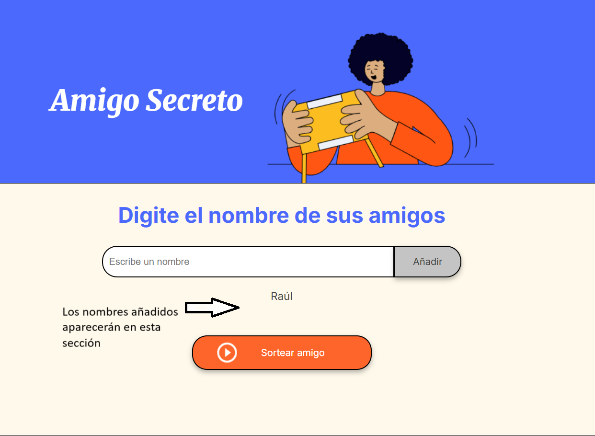
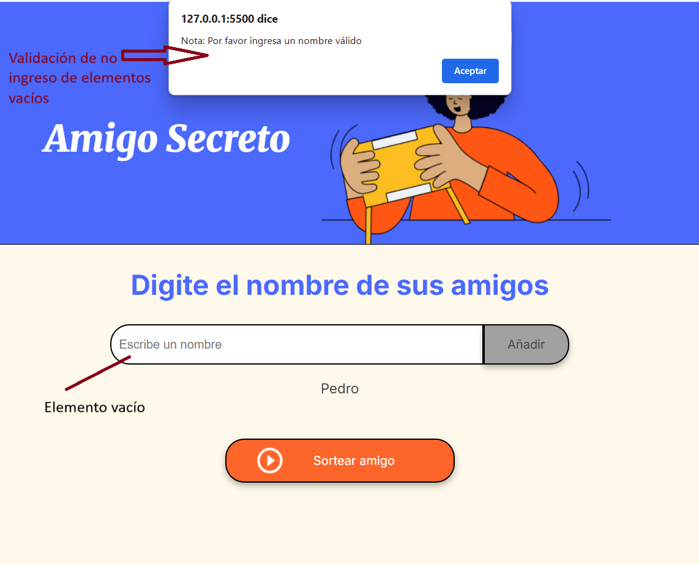
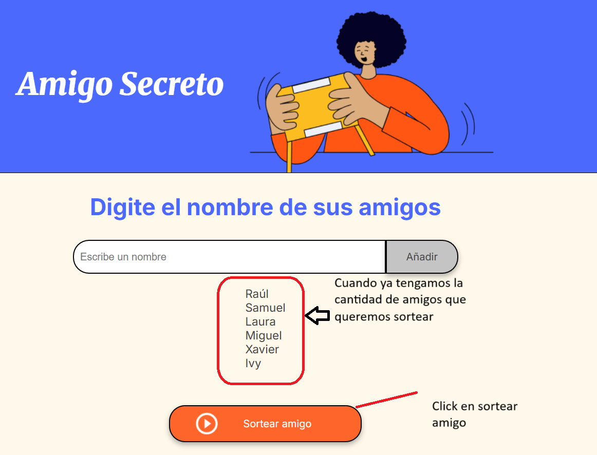
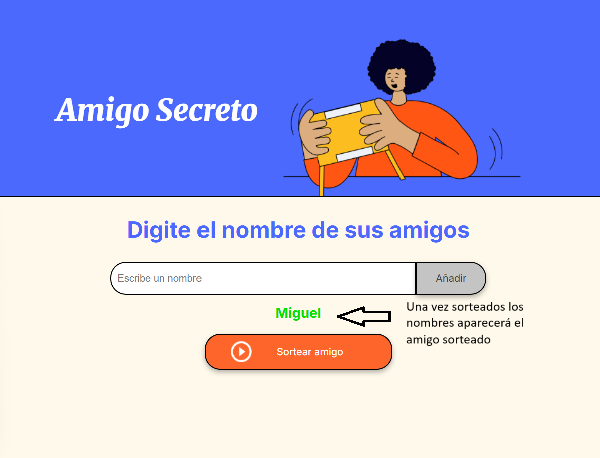

# Challenge amigo secreto
Version final del challenge amigo secreto reto de Alura Latam, este proyecto fue desarrollado por el aspirante Anthony Jiménez, dentro del plazo establecido por los organizadores de Alura Latam. Mediante este proyecto doy mis primeros pasos en el desarrollo de proyectos interactivos, además pone en práctica mi lógica de programación y mi habilidad para indagar en la documentación y otros recursos que conllevan a la implementación de soluciones eficientes.
<h2>Estado del proyecto</h2>

    Versión final del Challenge del amigo secreto concluido e incluye las siguientes funcionalidades. 
     Ingreso de los amigos al array.
     
     Visualización del nombre del amigo añadido.
     
     Validación de que el usuario no digite nombres vacíos.
     
     Sorteo de los nombres en un orden aleatorio.
     
     Visualización del resultado del sorteo.
     
     Validación de que el usuario no digite nombres repetidos. 
     Limpieza del elemento input donde se digitan los nombres guardados. 
     Vaciado del array una vez se obtenga el resultado del nombre sorteado. 

 <h3>Nota (Importante)</h3>
    Una vez que se ha sorteado y mostrado por pantalla el amigo secreto el array de amigos queda vacío.